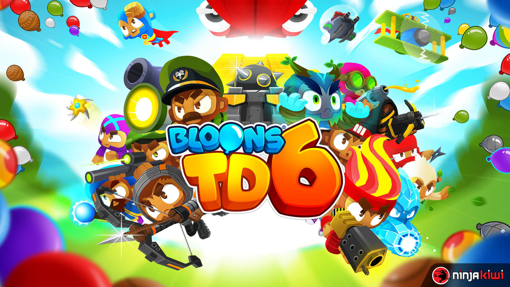

# BloonsTD6_Farming

<p align="center">
  
</p>

## Overview
BloonsTD6_Farming is a fully automated toolkit designed for resource farming in Bloons Tower Defense 6. This Python-based tool leverages [PyAutoGUI](https://pyautogui.readthedocs.io/en/latest/) and [OpenCV](https://opencv.org/) to perform efficient in-game actions and image recognition, enabling streamlined gathering of monkey money and leveling up for monkey knowledge.

**Note**: This toolkit is developed for **macOS only**.

## Credits
Inspired by the strategy outlined in ["BEST Way To AFK FARM Monkey Money - BTD6"](https://www.youtube.com/watch?v=YCRu2kkXXq4&t=225s) by [GameSteed](https://www.youtube.com/@GameSteed), this tool adapts and enhances the method for improved efficiency and compatibility with the latest version of BTD6.

## Requirements
- **Python 3.x**: Ensure you have Python 3.x installed. [Python installation tutorial](https://www.python.org/downloads/).
- **macOS environment**: This toolkit is designed to run on macOS.
- **Bloons Tower Defense 6 game**: Have the game installed.
- **Screen resolution**: Set to 1280 x 720.
- **Game Mode**: Unlock Expert - RAVINE map's Easy Mode's DEFLATION mode.
- **Hotkeys**: Use default hotkeys in BTD6 for consistency.
- **Give Permission**: Ensure your Python environment or IDE has the necessary permissions to control your computer. This includes enabling both Accessibility and Screen Recording under the Security & Privacy settings in macOS.
- **Sound and Graphics** (Optional): Mute game sounds and reduce graphics effects for a smoother experience.

## Installation
1. Install Git (if not installed) from [git-scm.com](https://git-scm.com/downloads).
2. Clone the repository: `git clone https://github.com/zw-g/BloonsTD6_Farming.git`.
3. Install required Python packages: `pip install -r requirements.txt`.

## Usage
Follow these steps to automate resource farming in BloonsTD6:

1. **Start the Game**: Launch BloonsTD6 and ensure you're on the screen with the "Play" button visible.
2. **Run the Script**: Execute the `/macOS/main` script from your Python IDE.
3. **Let It Run**: Sit back and allow the script to automate gameplay. Ensure BloonsTD6 remains the active window.
4. **Stopping the Script**: To stop the automation, use `Command + C` in your terminal or click the stop button in your IDE.

**Important Note**: After initiating the script, avoid interacting with your computer. The script requires BloonsTD6 to be the focused window and will automatically select it at the start.

## In-Game Setup
This script has a pre-configured setup for DEFLATION mode in BloonsTD6. You can customize the monkey placement and upgrades in the `setup_monkeys(self)` method within `main.py`. If you're unfamiliar with these settings, it's advisable to use the default configuration. Experienced players may wish to experiment with different settings.

### Modifying Monkeys:
- **Change Monkey**: Use `pyautogui.press('hotkey')` where 'hotkey' is the keyboard shortcut for the desired monkey (e.g., 'k' for Monkey Village).
- **Change Placement**: Modify the `x, y` coordinates in the script to reposition the monkey.
- **Upgrade Skills**: Utilize the keys `,`, `.` and `/` for upgrade paths 1, 2, and 3 respectively.
- **Number of Upgrades**: Alter the `presses` parameter to set the number of skill upgrades.

```python
# Example showing how to place the Monkey Village's at x=2830, y=800 and upgrade paths
# Note: In BTD6, you can only upgrade two paths for each monkey.
pyautogui.press('k')
pyautogui.click(x=2830, y=800, clicks=2, interval=0.5)
pyautogui.press(',', presses=3, interval=0.5)
pyautogui.press('.', presses=3, interval=0.5)
pyautogui.press('/', presses=3, interval=0.5)
```

## Disclaimer
This tool is intended for educational purposes. Users should employ it responsibly and in accordance with the game's terms of service.
